# DataTerps
- Shyam Solanke
- Shreeshail Gupte
- Kartik Hirijaganer
- Samarth Parasnis
- Dhruv Vaghani

## Objective
To develop standardized methods for analyzing executive compensation across Federal grant recipients,
explore trends, identify outliers, and make recommendations for forecasting future compensation trends. This includes comparing grant recipients' compensation to organizations not receving any grants and assessing the impact of grant funding on executive pay.

## Tech Stack
- Pandas
- Numpy
- XGBoost
- Matplotlib
- Searborn
- pyplot
- scikit-learn
- joblib (to extract zip files)

## Data Sources
- **Executive Information:** Executive information was gathered from **IRS 990** files submitted in IRS website. It contained details such as compensation, executive name, address, and organization.
- **Entity Information:** This data was collected from **SAM.gov** website. It contained entity details like address, purpose of registration, registration/activation date, business type, etc. 
- **Frederal Grants:** Data of federal grants was gathered from **USASpending.gov**. It contained details about the amount of grant received by the entity, the grant award date, and the federal subsidiaries that distributed the grant.

## Workflow

### Step 1: Data Aggregation

#### Step 1.0: Data Gathering

##### Entity Details
- Entity details were collected from SAM.gov website. The SAM_Public zip file was downloaded, and extracted.
- It contained a .dat file containing organization details separated by ‘|’, which were processed into a data frame and stored in a CSV file for further analysis of columns.
- This data was suitable for our analysis as it provided us with properties of organizations that either received federal grants or did not.

##### Executive Details
- Data was collected from the irs.gov website under form 990 series. 
- From the website zip files were downloaded, and extracted, containing .xml files, which were processed into a data frame.
- This data was suitable for our analysis as it provided us with details of executives such as their compensation.

##### Federal Grant Details
- Data was collected from the https://www.usaspending.gov/recipient website under Grants tab,using API **https://api.usaspending.gov/api/v2/recipient** to extract data.
- We extracted uei number, company name, and federal grant amount the company received.
- This data was important to get a list of companies that got federal grants so we can separate companies that got federal grants and which don't.

#### Step 1.1: Data Preprocessing
- **Merged Files:** Merged employee, company, and federal grant data into one file to process.
- **Dropped Columns:** Out of ~300 columns we selected 16 columns that could affect employee compensation from company data.
- **Mathematically Combined Columns:** Combined compensation columns to get total executive compensation.
- **Applied log transformation** Applied log transform on “grants” columns because it was heavily skewed to the right.
- **Decoded Columns:** Decoded the columns which were having code values instead of text.
- **Clustered Similar Categories:** Used K means clustering to combine similar job titles.
- **Removed Outliers:** Checked for outliers by plotting the columns and removed if found.
- **Added Geospatial Coordinates:** Added geospatial coordinates to plot the data on the map.

#### Step 2: Data Modeling
##### Data Model Flow
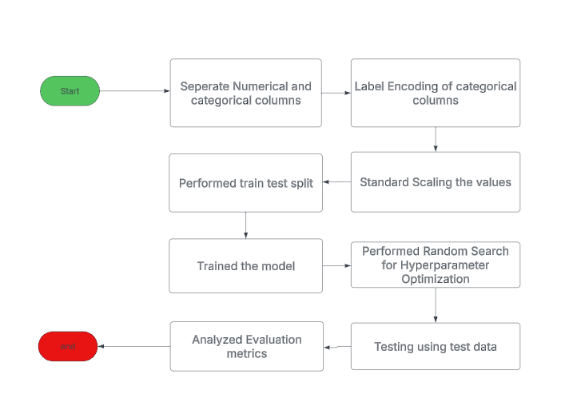

##### Model Metrics
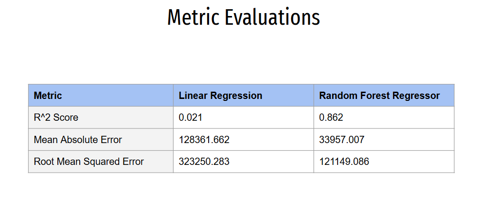

#### Step 3: Findings

1. **Average Compensation by Top 15 Job Roles**
  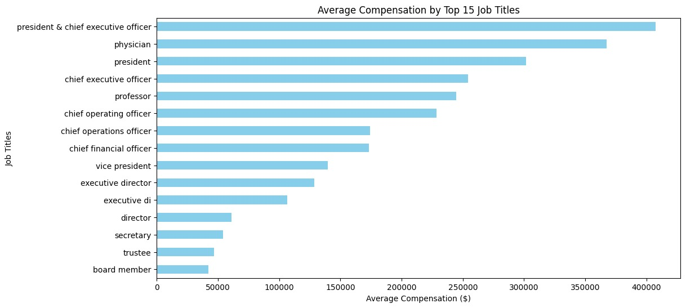
    1. Top Compensation Roles: Presidents & CEOs receive the highest average compensation (~$400,000), highlighting their leadership and strategic influence.
    2. Specialized High Earners: Physicians rank among the top-paid roles, reflecting the demand and expertise required in medical positions.
    3. Compensation Hierarchy: Directors and Trustees have significantly lower compensation compared to executive roles, emphasizing the financial gap between oversight roles and top leadership.

2. **Grants to Compensation Ratio by Top 15 Job Roles**
  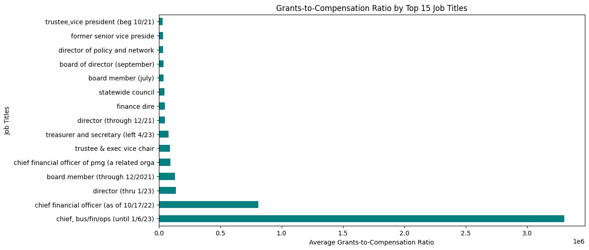
    1. CFOs manage grants efficiently, with an Extreme Grants-to-Compensation Ratio for Certain Roles – The "chief, bus/fin/ops (until 1/6/23)" position has an exceptionally high grants-to-compensation ratio compared to all other job titles, indicating that this role received significantly more in grants relative to compensation.
    2. Chief Financial Officer Stands Out – The "chief financial officer (as of 10/17/22)" position also has a much higher grants-to-compensation ratio compared to other roles. However, it is still far below the "chief, bus/fin/ops" role. This suggests that CFOs, in general, receive a substantial portion of grants in addition to their compensation.
    3. Most Other Roles Have Negligible Grants-to-Compensation Ratios – Apart from the two roles mentioned above, most job titles have a very low ratio, indicating that they receive little to no grants compared to their compensation.

3. **Compensation, Grants, Activation Seconds**
  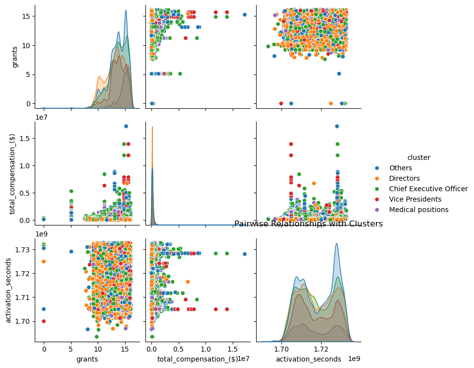
    1. Relationship: Higher grants correlate with higher total compensation, especially for CEOs and Vice Presidents, who dominate the upper compensation range.
    2. Clustered Distributions: Directors and Medical Positions have more concentrated grant values, while CEOs show a broader range of grants and compensation.
    3. Activation Time Insight: No strong relationship exists between activation_seconds and other variables, indicating it’s independent of compensation and grants.

4. **Compensation Disparity**
  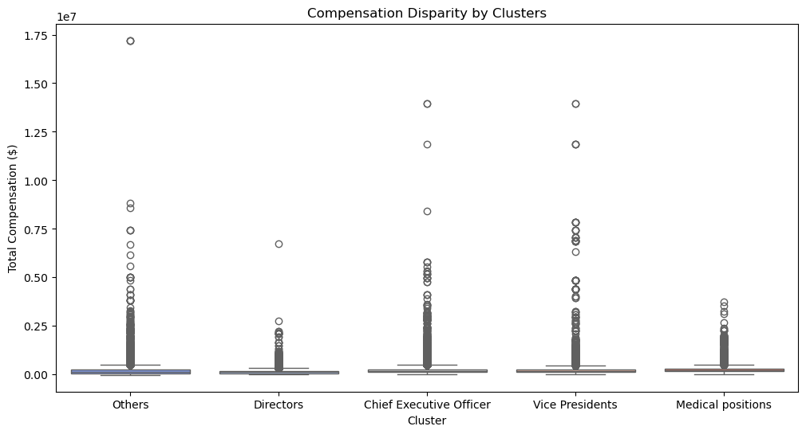
    1. High Compensation Disparity: All clusters exhibit wide variation in total compensation, with notable outliers earning exceptionally high salaries.
    2. CEOs & VPs Lead in Pay: Chief Executive Officers and Vice Presidents have some of the highest outliers, exceeding $1.5M, reflecting their leadership roles.
    3. Directors & Others Have Lower Variability: These clusters show more consistent compensation levels, with fewer extreme outliers.
    4. Medical Positions Also Show High Earners: While not as extreme as CEOs, some medical professionals receive substantial compensation, likely due to specialized expertise.

5. **Grants Distribution by State**
  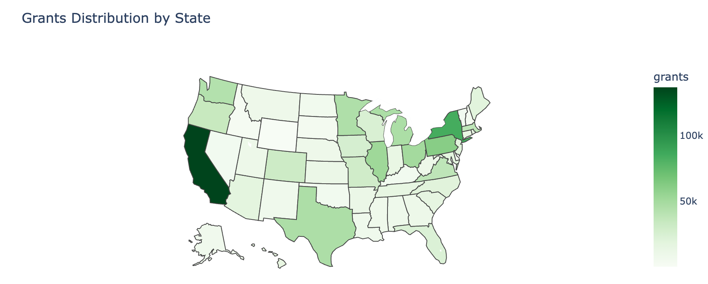
    1. California & New York receive the highest grants, reflecting their strong research and institutional presence.
    2. Texas and Illinois have moderate grant funding, suggesting a balance between corporate and academic research contributions.
    3. Rural states show lower grant allocations, indicating fewer research institutions or funding opportunities.
    4. Regional disparities highlight potential policy changes, encouraging more equitable grant distribution.

6. **Compensation by State**
  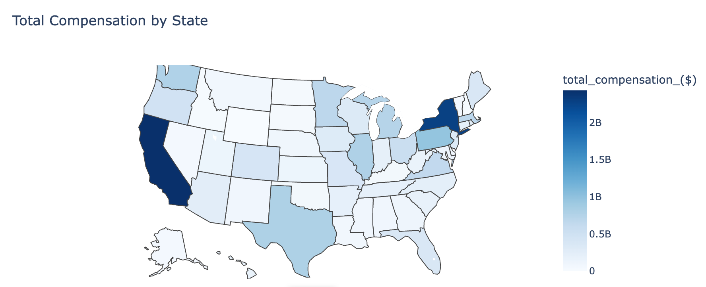
    1. California & New York dominate total compensation, driven by corporate, finance, and tech sectors.
    2. Texas and Illinois hold mid-level compensation, likely influenced by a mix of industries.
    3. Lower compensation in rural states indicates fewer high-paying organizations.
    4. Clear regional disparities suggest opportunities for business expansion in lower-compensated states.

7. **Average Compensation and Total Grants by State**
  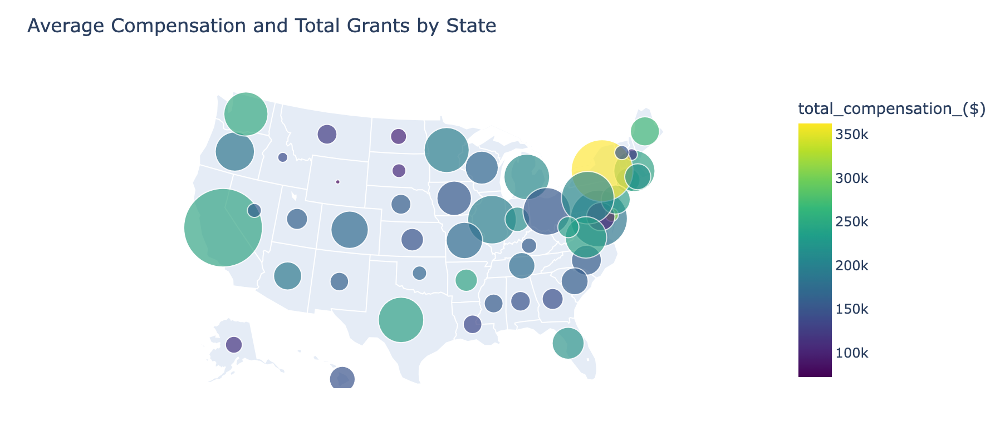
    1. California leads in total grants and high compensation, reinforcing its role as a financial and innovation hub.
    2. New York and Massachusetts have substantial grants & high executive compensation, indicating major corporate and research centers.
    3. Texas stands out with strong grant allocation but moderate compensation levels.
    4. Smaller grants and lower compensation dominate central & rural states, highlighting geographic disparities in funding and executive pay.
  
8. **Executive compensation comparison between Grant receiving vs Non-Grant receiving Organizations**
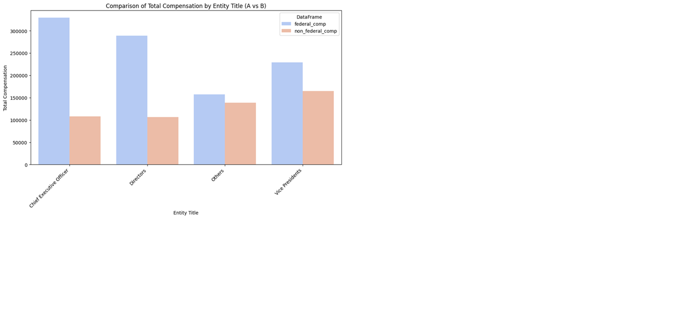

### Conclusion
#### Top 4 Features
1. **Job Title**: Executive role is the strongest predictor of their total compensation.
2. **Business Type**: Industry sector in which the business is operating.
3. **Grants Received**: The amount of federal grants received by the company also plays a crucial role.
4. **Purpose of Registration**: Comparatively lower impact.

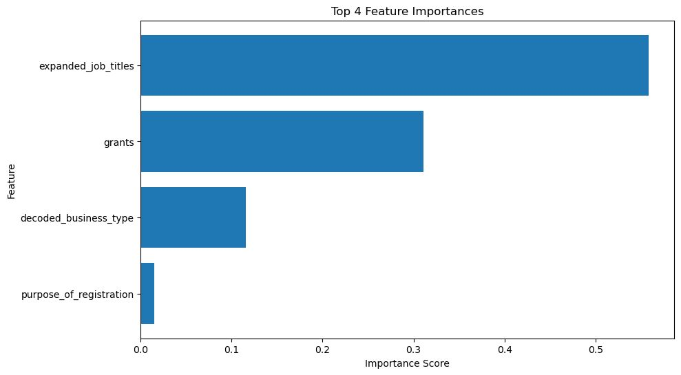

#### Summary of Findings
- The feature importance analysis for our model, which predicts executive compensation, highlights that job title (expanded_job_title) is the most significant factor. This suggests that an executive's role within a company is the strongest predictor of their total compensation.
- Additionally, the amount of federal grants received by the company plays a crucial role, indicating that organizations with higher federal funding may offer greater compensation to their executives.
- On the other hand, while business type (decoded_business_type) and purpose of registration do contribute, their impact is relatively lower. This suggests that while the industry sector and the company’s intent to obtain grants have some influence, they are not as strong as direct role-based or funding-based factors.
Overall, our findings emphasize that leadership position and financial backing (grants) are key determinants of executive pay, while industry type and registration purpose have a lesser impact.
